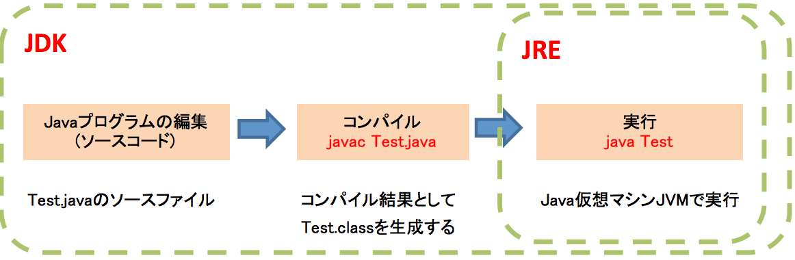
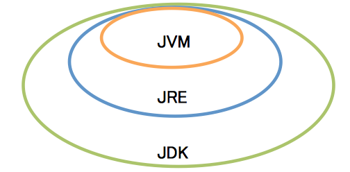

==================================
第１章：Java実装環境と流れ
==================================

・ Javaプログラムの作成から実行まで
-----------------------------------

.. tip::
  一つのソースファイル内に複数のクラス定義を行った場合、ソースファイル内の全てのクラス定義に基づいてクラスファイルが生成される。

  例：sample.javaの中、三つのクラスsample, test, passを定義した場合、コンパイル時、sample,test,passのclassファイルが生成される。

 .. image:: ../images/sampleJava.png

.. important::
 一つのJavaソースファイルでは複数のpublicクラスを定義することができないため、public修飾子を指定した場合、ソースファイル名とクラス名を同じにしなれけばならない。

Javac Test.javaを実行する時、もしソースコードの中に、日本語がある場合、エラーになりますので、以下のように実行が必要。

.. code-block:: python
   
   Javac -encoding UTF-8 Test.java

文字コードを指定するには「-encoding」オプションを使います。

Javaプログラム動作環境
---------------------------------

特徴：Javaで一つのプログラムを作成することで、どのコンピュータ上でも動作させることができます。

#. JVM（Java Virtual Machine）Java仮想マシンとは：バイトコードのJavaプログラムを解釈し実行するソフトウェア。
#. JRE（Java Runtime Environment）とは：Java実行環境。JVMおよびプログラムの実行に必要なライブラリがまとめられた。
#. JDK（Java Development Kit）とは：Java開発環境と言います。Javaでプログラムを作成する時必要です。

JVM、JREとJDKの範囲は以下の図で示します。

.. important::
 JDKにはJREが含まれています。つまり、Java開発環境ではJDKのインストールとPath設定が必要です。

 参考URL:　http://www.task-notes.com/entry/20140810/1407599796

Javaプラットフォーム各エディションの特徴と説明
----------------------------------------------------

     
.. |br| raw:: html

   

